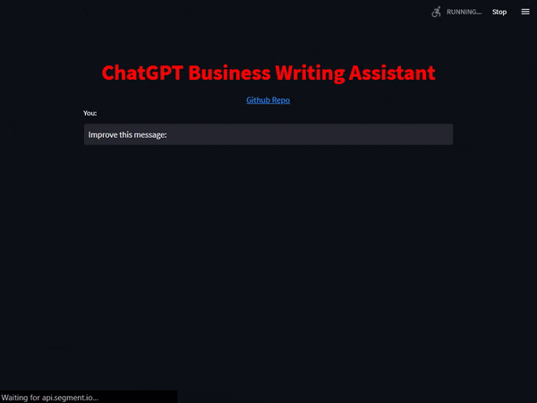

# ChatGPT Customized Assistant 🤖
Create your own custom ChatGPT assistant in **5 minutes** using ChatGPT API and Streamlit!  




# Getting Started
1. Clone this repository
```bash
git clone https://github.com/VRSEN/chatgpt-customized-assistant.git
```
2. Create a venv and install the requirements:
```bash
python3 -m venv ./venv

.\venv\Scripts\activate

pip install -r requirements.txt
```
3. Get your API key from [OpenAI](https://platform.openai.com/account/api-keys) and set it as an environment variable:
```bash
# Windows
set OPENAI_API_KEY=<your_api_key>
```
```bash
# Mac/Linux
export OPENAI_API_KEY=<your_api_key>
```
4. Run the script:
```bash
streamlit run assistant.py
```

# How to Customize 
1. Change the system message at https://github.com/VRSEN/chatgpt-customized-assistant/blob/d034e730740c92cffb3133f87032fd6ea6952264/assistant.py#L24-L26
  
2. Change the default user message (`Improve this message: `) at https://github.com/VRSEN/chatgpt-customized-assistant/blob/d034e730740c92cffb3133f87032fd6ea6952264/assistant.py#L54

3. Add/change any model parameters at https://github.com/VRSEN/chatgpt-customized-assistant/blob/d034e730740c92cffb3133f87032fd6ea6952264/assistant.py#L43-L47

# Credits
This project was created by VRSEN (pronounced as "Arsen") using [Streamlit](https://streamlit.io/) 
and [Streamlit Chat](https://github.com/AI-Yash/st-chat).

If you need more a more sophisticated assistant, with payments/production backend/custom UI reach out to me on Fiverr or Upwork:
- [Fiverr](https://www.fiverr.com/arseny9795)
- [Upwork](https://www.upwork.com/freelancers/~01214517c56834a591)

# License
This project is licensed under the MIT License - see the LICENSE file for details
